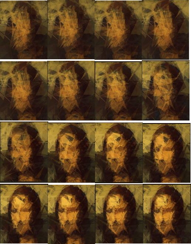
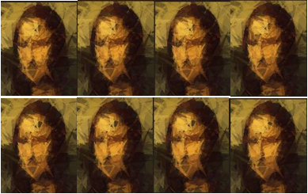

# Evolutionary Image Reconstruction

This project uses a genetic algorithm to reconstruct an image using semi-transparent polygons. The algorithm evolves a population of images over generations to approximate the target image as closely as possible.

## How It Works

The algorithm follows these steps:

1. **Initialization**: A population of random polygon-based images is created.
2. **Fitness Evaluation**: Each image is compared to the target image using Mean Squared Error (MSE) as the fitness metric.
3. **Selection**: The best individuals (images) are selected based on their fitness scores.
4. **Crossover**: New images are created by combining polygons from two parent images.
5. **Mutation**: A probability-based mutation alters some polygons to introduce diversity.
6. **Elitism**: A small fraction of the best individuals are carried forward unchanged.
7. **Iteration**: The process repeats over multiple generations, gradually improving the image.

## Features
- **Adaptive Mutation**: Adjusts mutation rate dynamically based on current fitness.
- **Polygon Sampling from Image**: Uses colors sampled from the target image for better initialization.
- **Adaptive Transparency**: Transparency of polygons increases over generations for smoother blending.
- **Save Checkpoints**: Saves intermediate images at key generations to visualize progress.

## Requirements
Install dependencies before running the code:

```bash
pip install numpy pillow
```

## Usage
1. Place the target image in the project directory and update the `TARGET_IMAGE_PATH` in `evolutionary_code.py`.
2. Run the script:

```bash
python evolutionary_code.py
```
3. The best result will be saved as `best_result.png`, with intermediate generations saved periodically.

## Results
The following images demonstrate the evolution over generations:




## Future Improvements
- Optimize polygon placement using reinforcement learning.
- Experiment with different fitness functions (e.g., SSIM instead of MSE).
- Implement parallel processing for faster evolution.

## License
This project is released under the MIT License.
